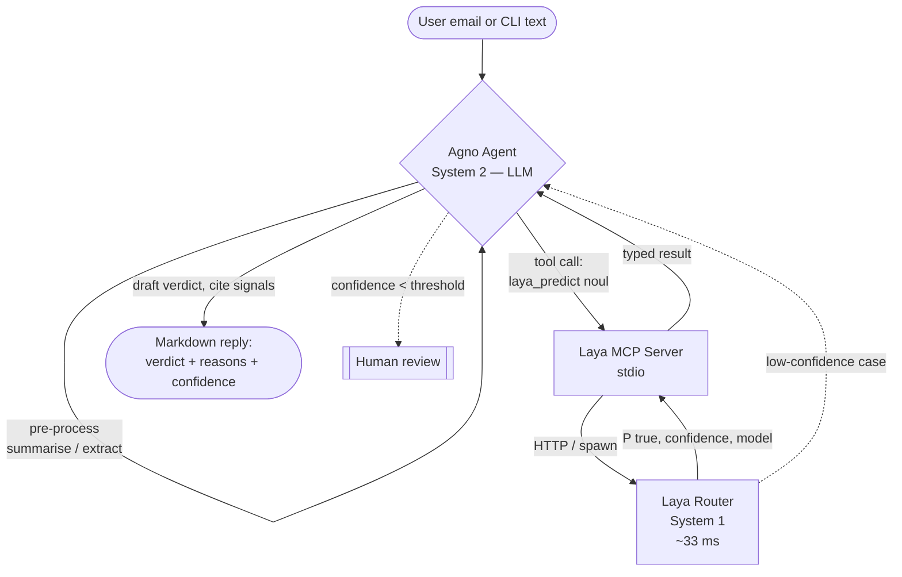

# EmailDetective

Agno-powered agent that classifies arbitrary content (emails, messages, snippets) as
phishing or legitimate. Uses [Laya](https://github.com/NandhaKishorM/laya) as the
fast typed-decision engine, talks to Laya through the
[Agno MCP](https://docs.agno.com/tools/mcp) integration, and uses
[Ollama](https://ollama.com/) as the LLM backend.

```
content ──► Agno Agent (Ollama) ──► MCPTools (Laya MCP server) ──► Laya Router ──► verdict
```

## Contents

- [Layout](#layout) — file map of the `emaildetective` package.
- [Quick start (first-time user)](#quick-start-first-time-user) — install,
  configure `.env`, and run `detect` / `agent` from the CLI.
- [Serving over REST (AgentOS)](#serving-over-rest-agentos) — run the
  FastAPI service and call `/agents/{id}/runs` from curl or the
  Python client.
- [Laya & System 1](#laya--system-1) — what System 1 models are, why
  Laya uses `noul`, and how the MCP tools plug into Agno.
- [System 1 + System 2 collaboration](#system-1--system-2-collaboration)
  — how Laya and the LLM split responsibilities in the agent loop,
  with a flow diagram.

## Layout

```
src/emaildetective/
├── __init__.py        # public exports
├── config.py          # Settings (pydantic-settings) loaded from .env
├── models.py          # Pydantic models: LLMConfig, PhishingMCPConfig, PhishingAgentConfig
├── llm.py             # build_llm() — constructs an agno.models.ollama.Ollama
├── laya_detector.py   # LayaPhishingDetector — typed `noul` phishing question over Laya
├── agent.py           # PhishingDetectionAgent — Agno Agent wired to MCPTools
├── agentos.py         # FastAPI app exposing the agent over REST (AgentOS)
└── main.py            # `emaildetective` CLI entry point
```

---

## Quick start (first-time user)

The whole project is one editable package with one CLI. To use it end-to-end
you need three things running: Python 3.12, Ollama with a model pulled, and
the Laya Python package (which is auto-installed).

### 1. Clone & install

```bash
git clone <your-fork-url> EmailDetective
cd EmailDetective
uv venv --python 3.12
source .venv/bin/activate
uv pip install -e ".[mcp]"
```

The `[mcp]` extra installs `laya[mcp]`, which pulls in the
`laya-mcp-server` stdio binary that the Agno agent will talk to.

### 2. Start Ollama & pull the model

```bash
# in another terminal
ollama serve                          # if not already running
ollama pull minimax-m3:cloud          # or any chat model you prefer
```

If Ollama is on a different host, edit `.env` (next step). The default
`http://localhost:11434` matches a fresh local install.

### 3. Configure `.env`

```bash
cp .env.example .env
```

The defaults work out of the box for a local Ollama + `minimax-m3:cloud`
setup. Override any of:

| Variable | Default | Purpose |
|---|---|---|
| `OLLAMA_HOST` | `http://localhost:11434` | Ollama server URL |
| `OLLAMA_MODEL` | `minimax-m3:cloud` | Model tag the agent calls |
| `OLLAMA_API_KEY` | _(unset)_ | Required for Ollama Cloud |
| `LAYA_PRELOAD` | `false` | Preload all Laya checkpoints at startup |
| `LAYA_DEFAULT` | `english` | Default Laya checkpoint |
| `LAYA_DEVICE` | `auto` | Torch device for Laya inference |
| `LAYA_MCP_ENABLED` | `true` | Attach the Laya MCP server to the agent |
| `LAYA_MCP_COMMAND` | `laya-mcp-server` | Stdio command for the Laya MCP server |
| `PHISHING_THRESHOLD` | `0.5` | P(phishing) threshold for the verdict |
| `AGENTOS_HOST` | `0.0.0.0` | REST API bind host |
| `AGENTOS_PORT` | `7777` | REST API bind port |

### 4. Sanity-check your configuration

```bash
emaildetective info
```

This prints every setting the runtime will use, so you can confirm the
model name, Ollama host, and Laya command are what you expect before
launching anything heavier.

### 5. Try the local Laya detector first (no LLM)

The fastest way to confirm Laya is wired correctly:

```bash
echo "Click here to verify your account: http://paypa1.example/verify" \
    | emaildetective detect
```

You'll get a one-shot score (no streaming, no model round-trip):

```
is_phishing     : True
probability     : 0.87
confidence      : 0.71
threshold       : 0.50
routed_model    : english
routing_reason  : Latin script and looks English
```

The first call downloads the Laya checkpoint from the Hugging Face Hub
(~421 MB for `laya`, ~322 MB for `laya-multilingual`).

### 6. Run the full Agno agent

```bash
echo "Subject: URGENT - Verify your PayPal account
From: support@paypa1-security.com
Body: Click http://paypa1-login.example/verify to keep your account active." \
    | emaildetective agent
```

The agent will (a) decide which Laya checkpoint to use, (b) call the
`laya_predict` MCP tool with a typed `noul` phishing question, and (c)
write a markdown verdict explaining the strongest phishing signals.

For a saved file:

```bash
emaildetective agent ./suspicious_email.txt
```

### 7. Skip the LLM and serve the detector over REST

If you'd rather have a service other apps can hit, jump straight to the
REST chapter below.

---

## Serving over REST (AgentOS)

`emaildetective.agentos` wraps the agent in a FastAPI app via Agno's
[AgentOS](https://docs.agno.com/agent-os) runtime. Once it's up you get a
full REST surface — runs, sessions, traces, knowledge, schedules, the
AgentOS MCP server — for free.

### Start the server

```bash
emaildetective serve
# or with explicit overrides
emaildetective serve --host 127.0.0.1 --port 8000 --reload
# or via uvicorn directly
uvicorn emaildetective.agentos:app --reload
```

`AGENTOS_HOST` and `AGENTOS_PORT` come from `.env`; CLI flags win.

### Discover the runtime

```bash
curl -s http://localhost:7777/info | jq
```

Returns the OS metadata, registered agent/team/workflow counts, MCP
status, and `auth_mode` (default `none`).

### Run the phishing agent

```bash
curl -X POST http://localhost:7777/agents/emaildetective/runs \
  -H "Content-Type: application/x-www-form-urlencoded" \
  --data-urlencode "message=Is this phishing?

Subject: Verify your account
From: support@paypa1-security.com
Body: Click http://paypa1-login.example/verify" \
  --data-urlencode "stream=false"
```

The response is a single JSON object with the `run_id`, `session_id`,
`content` (the agent's reply), `model`, `metrics`, and `status`.

> **Reuse `session_id` to keep a thread.** Pass your own
> `--data-urlencode "session_id=customer-42"` so consecutive calls
> append to the same conversation. AgentOS also exposes
> `/sessions`, `/memory`, `/knowledge`, and `/traces` for that
> session.

### Stream events

```bash
curl -N -X POST http://localhost:7777/agents/emaildetective/runs \
  -H "Content-Type: application/x-www-form-urlencoded" \
  --data-urlencode "message=Investigate this account" \
  --data-urlencode "stream=true"
```

`AgentOS` emits Server-Sent Events as the model produces tokens and as
tools (`laya_predict`, `laya_route`, …) run.

### Use the Python client from another service

```python
import asyncio
from agno.client import AgentOSClient

async def main():
    client = AgentOSClient(base_url="http://localhost:7777")
    resp = await client.run_agent(
        agent_id="emaildetective",
        message="Subject: ... Body: ...",
        user_id="customer-42",
        session_id="thread-42",
    )
    print(resp.content)

asyncio.run(main())
```

### Embed the app in your own FastAPI

```python
from emaildetective.agentos import build_app

app = build_app()  # returns the configured FastAPI instance
```

Mount `app` behind your existing router, or pass it to uvicorn.

### Auth

`auth_mode` defaults to `none`. To require a bearer token, set
`authorization=True` on the `AgentOS(...)` constructor in
[`src/emaildetective/agentos.py`](src/emaildetective/agentos.py) and supply
an `OS_SECURITY_KEY` environment variable. JWT mode is configured the
same way. See the
[AgentOS Security & Auth](https://docs.agno.com/agent-os/security/overview)
docs for service-account tokens (`agno_pat_*`).

---

## Laya & System 1

EmailDetective is built on
[Laya](https://github.com/NandhaKishorM/laya), a non-autoregressive
**System 1 decision engine** trained with reinforcement learning against
strictly proper scoring rules (RLCD). To understand *why* the project is
shaped this way it helps to know the background.

### Kahneman's System 1 / System 2

In *Thinking, Fast and Slow* (2011) Daniel Kahneman describes two modes of
reasoning:

- **System 1** — fast, automatic, low-effort, parallel. Recognises a face,
  reads "2+2=4" as true, drives a car on an empty road. Intuitive and
  reactive.
- **System 2** — slow, deliberate, effortful, sequential. Solves
  `17 × 24`, fills out a tax form, writes an essay. Allocates attention
  and self-monitors.

LLMs are textbook System 2 machines: they emit one token at a time, plan
ahead, and burn thousands of FLOPs per word. That's exactly what you want
for open-ended generation — and exactly the wrong tool for routine
classification tasks like "is this email phishing?".

### What System 1 means for ML

[TypeSafe's introduction to System 1 models](https://typesafe.ai/blog/introducing-system-one-models-and-jev)
frames the goal as **specialised, low-latency decision heads** that can be
called from System 2 agents:

> System 1 models are designed to handle fast, routine decisions with
> minimal latency, allowing System 2 models (like large generative LLMs)
> to focus on more complex tasks that require deep reasoning.

Concretely:

- **Non-autoregressive** — one forward pass, no left-to-right decoding.
- **Typed outputs** — `choice`, `score`, `noul` (yes/no with calibrated
  probability) instead of free-form text.
- **Calibrated probabilities** — trained with proper scoring rules so the
  reported `P(true)` is statistically meaningful, not a vibes score.
- **Routable** — small, fast heads can dispatch to larger frontier models
  when a decision is hard or unusual.

### What Laya adds on top

Laya ([`convaiinnovations/laya`](https://huggingface.co/convaiinnovations/laya))
ships three typed-decision checkpoints plus a router that picks the right
one per request:

| Checkpoint | Backbone | Params | Context | Best for |
|---|---|---|---|---|
| `laya` | ModernBERT-large | 421M | 512 | English |
| `laya-multilingual` | mmBERT-base | 322M | 1,024 (up to 8,192) | 100+ languages, 2× faster |
| `laya-typed-decisions` | ModernBERT-large | 421M | 1,024 | Fine-tuned on the typed-decisions benchmark |

The `Router` detects the script and language in under a millisecond and
dispatches the right checkpoint — so EmailDetective works in English,
Hindi, Spanish, etc., with no extra configuration.

### Why a `noul` question for phishing

Laya's three primitives are:

- **`choice`** — top label out of a fixed set with per-option probabilities.
- **`score`** — expected level on an ordinal rubric (e.g. urgency 0–2).
- **`noul`** — calibrated `P(true)` for a binary decision.

Phishing detection is a calibrated binary decision, so we use a `noul`
question with carefully chosen semantic option text:

```python
{
    "type": "noul",
    "instructions": (
        "Is this content a phishing attempt — i.e. does it try to trick the "
        "reader into revealing credentials, sending money, installing malware, "
        "or clicking a malicious link by impersonating a trusted party?"
    ),
    "criteria": {
        "true": "yes, this is a phishing attempt",
        "false": "no, this is a legitimate message",
    },
    "labels": {"true": "A", "false": "B"},   # avoid boolean-word bias
}
```

The result has a precise meaning: a return of `0.87` means "calibrated
87% probability of being phishing", not "the model said yes-ish". You
can then gate on that probability with `PHISHING_THRESHOLD` and route low-
confidence cases to a human.

### What this looks like in the agent loop

The `MCPTools(command="laya-mcp-server")` line in
[`src/emaildetective/agent.py`](src/emaildetective/agent.py) attaches Laya's
MCP tools (`laya_predict`, `laya_route`, `laya_shortlist`, `laya_preset`,
`laya_status`) to the Agno agent. When a user asks "is this phishing?",
the agent:

1. Calls `laya_predict` (or `laya_preset(name="triage")`) on the email —
   one forward pass, ~33 ms.
2. Reads the calibrated `noul` and `confidence`.
3. Writes a short markdown report naming the strongest phishing signals.
4. Recommends a human review when confidence is below
   `PHISHING_THRESHOLD`.

The LLM (System 2) handles the explanation and the routing. Laya (System 1)
handles the verdict. The result is faster, cheaper, and harder to
hallucinate than asking the LLM to "decide if this is phishing".

---

## System 1 + System 2 collaboration

EmailDetective treats Laya and the LLM as a deliberate
**System 1 ↔ System 2 pair** — each model does the part it's good at,
and the Agno agent orchestrates the handoff. The two never duplicate work.

### Roles at a glance

| Aspect | System 1 (Laya) | System 2 (Ollama LLM) |
|---|---|---|
| Speed | ~33 ms per call (single forward pass) | Seconds to minutes (auto-regressive) |
| Output | Calibrated `P(true)` + confidence | Natural-language reasoning, tool calls |
| Cost | Tiny — runs on CPU/MPS/CUDA | Heavy — VRAM-bound, GPU preferred |
| Best at | "Is this phishing?" (binary, well-typed) | "Why?", "Explain it", "What should I do?" |
| Failure mode | Confident but wrong on out-of-distribution input | Hallucinates explanations; vague scores |
| Trigger | Every classification request | Only when a *reasoned answer* is needed |

### How a request flows



Read it as a tight loop:

1. **The LLM (System 2)** receives the raw email. It can pre-process —
   strip quoted replies, extract the suspect URL, condense the body.
2. **It calls Laya (System 1)** as a tool via the Laya MCP server with a
   `noul` phishing question.
3. **Laya returns** a calibrated `P(phishing)` and `confidence` in one
   forward pass — no token decoding, no hallucination.
4. **The LLM writes the verdict**, grounded in Laya's score and naming
   the strongest phishing signals (sender domain, urgency cues, link
   mismatch, …).
5. **If Laya's confidence is below `PHISHING_THRESHOLD`** the agent
   recommends human review instead of forcing a verdict.

### Why the handoff matters

- **Cheap routine, expensive reasoning.** Laya does the high-volume,
  well-typed decision; the LLM only does the part that genuinely
  benefits from autoregressive generation.
- **Grounded explanations.** The LLM cannot invent a probability — it
  must cite the `P(true)` Laya gave it. The verdict is anchored to a
  calibrated score, not to the model's own mood.
- **Independent failure modes.** If Laya mis-scores an adversarial
  email, the LLM can flag "low confidence, please verify". If the LLM
  hallucinates, Laya's score still gates the final threshold — a
  hallucinated "definitely phishing" without a high `P(true)` is
  visible to reviewers.
- **Latency & cost.** Most requests skip a long LLM chain — for batch
  scoring, `emaildetective detect` calls Laya directly with no LLM in
  the loop at all.

### End-to-end example

```text
input   : "Subject: URGENT - Verify your PayPal account
           From: support@paypa1-security.com
           Body: Click http://paypa1-login.example/verify"

Laya    : noul("…is this a phishing attempt?") → P(true)=0.91, conf=0.78
LLM     : "Phishing (high confidence). Strongest signals:
           (1) sender domain 'paypa1-security.com' spoofs PayPal via
           digit-substitution;
           (2) urgency framing 'URGENT - Verify';
           (3) link host 'paypa1-login.example' is unrelated to PayPal.
           Recommend: do not click; report to IT."
```

Same pipeline, same `PHISHING_THRESHOLD`, same MCP server — only the
mix of System 1 / System 2 changes based on whether the caller wants a
number (`detect`) or a reasoned answer (`agent` / REST `/runs`).

